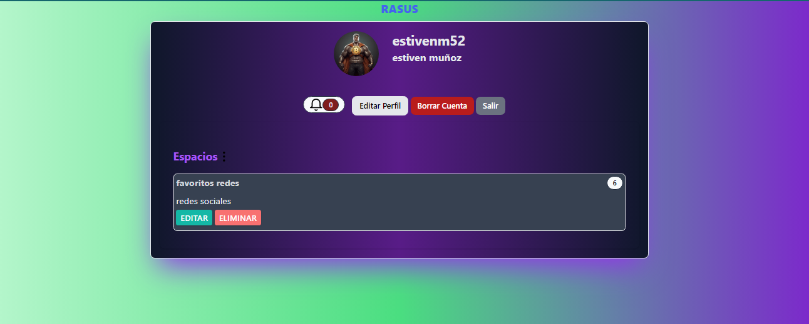
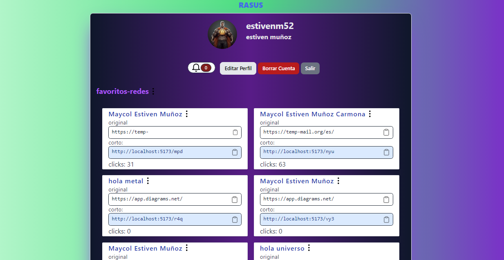

# Rasus
Rasus: Transforma tus Enlaces, Simplifica tu Mundo
Rasus es acortador de enlaces; tu compañero digital para simplificar la gestión y compartir de URL.

## Demostración
[]
[]

video: https://youtu.be/yB9iMueEPH8

## Características Destacadas

### Registro e Inicio de Sesión:
- Los usuarios pueden crear cuentas y acceder fácilmente a sus perfiles.

### Gestión de Perfil:
- Perfil de usuario con opciones de edición de datos y agregar foto de perfil, ademas, puede eliminar de forma permanente la cuenta.

### Acortar Enlaces:
- EL usuario puede acortar y guardar enlace, también puede editarlos y eliminarlos.

### Crear Espacios:
- El usuario puede crear, editar y eliminar espacios donde se agrupan enlaces.

### Notificaciones:
- El usuario recibe notificaciones cada cierta cantidad de clicks que reciba el enlace.

## Tecnologías Utilizadas
- React
- TailwindCSS
- TanStack Query
- Shadcn-ui

